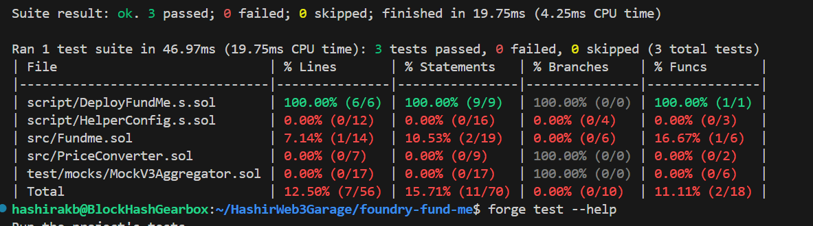
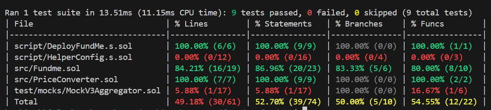

- forge install smartcontractkit/chainlink-brownie-contracts@1.1.1 --no-commit
    - Using this command we can install the smartcontracts/tools into the lib folder of foundry project.

- Foundry config edit: made remapping. remappings = ["@chainlink/contracts/=lib/chainlink-brownie-contracts/contracts"]
    - This'll map the import from remote to local import that's present in lib folder.

- forge test -vvv [No of v = no.of console messges.]
    - This'll print the console.log msgs according to the numbers of v's present.

- forge test --match-test testPriceFeedIsAccurate -vv ==> To run a specific test
    - To run a specific test. Try forge test --help for more.
    
- forge test --match-test testPriceFeedIsAccurate -vvv --fork-url $SEPOLIA_RPC_URL
    - This is used to run the test on the sepolia test net.

- forge coverage --fork-url $SEPOLIA_RPC_URL ==> To get code coverage.

- Learned to write and test smart contrats with tests.

- Learned modular deployments and tests.

- forge test --match-test testPriceFeedIsAccurate -vvv --fork-url $SEPOLIA_RPC_URL ==> Inorder to run this test on local anvile chain, we need to use a mock contract. So creating a fake priceFeed and then deploying it on oru local anvil.

- anything before startbroadcast is not accounted as a real txn.

13.07.2024:
    - Wrote custom mock tests for priceFeed.
    - 
    - 
    - Storage varialbles should start with 's_'.
    - Foundry Chisel to get line by line solidity code information.
    - forge snapshot --match-test testWithrawWithMultipleFunder ==> Generates a gas information snapshot file.
    - forge inspect FundMe storageLayout ==> Returns the storage layout of the contract.
    - cast storage <address> index ==> return the storage at the index.

14.07.2024:
    - Proper ReadMe
    - Integration Tests
    - Programatic verification
    - Push to GitHub
    - We don't have a programatic way to interact with out smartcontracts here. Ex: Funding and Withdrawing.
    - We can use 'forge script' for a reproducible way to actually fund and withdraw.
    ffi = true; in foundry toml means that foundry can run commands directly into your machine.
    - Integration tests are for testing interaction scripts.
    - Automating smart contract actions using Make files.
    - Go through the makefile of the foundry-f23 github repo.